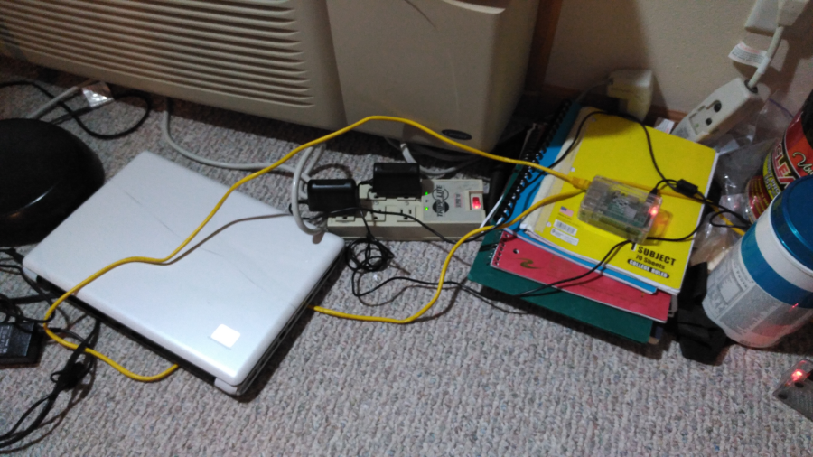
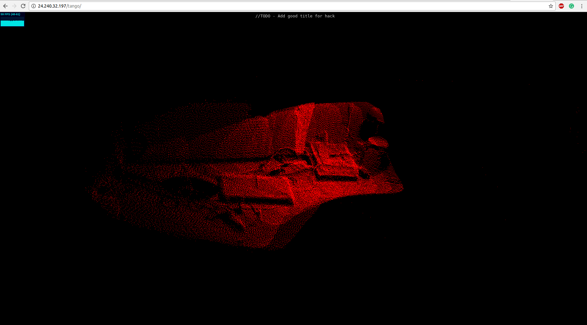
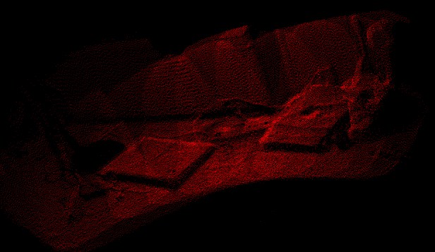
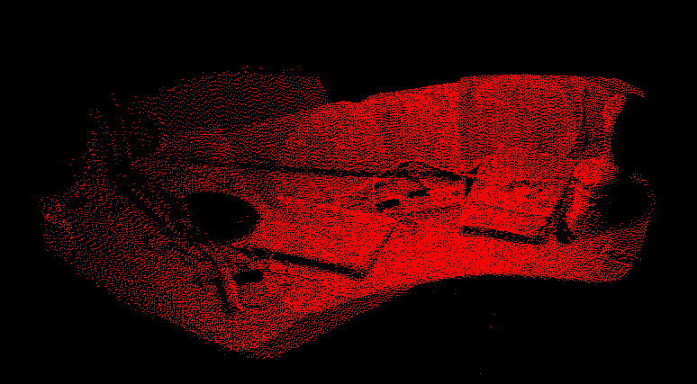

# Tango NDK Maps
This project is to create real time maps from the Tango device to a web browser

## Sockets
* Using both [Socket.io](https://github.com/socketio/socket.io) and [Android NDK Sockets](https://github.com/sjfricke/Android-NDK-WebSocket) the Tango device sends smartly reduced data to the server where it processes it and sends it off to the client browser session.

## Demo
Note that this is a first, proof-of-concept demo and there is a TON of room for improvement

